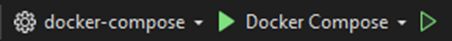
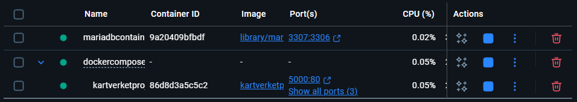
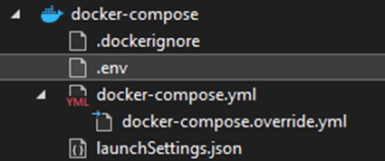
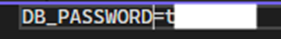
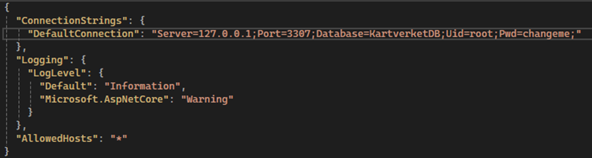
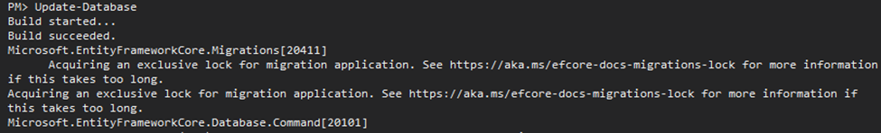
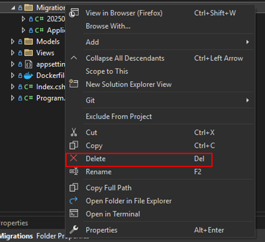
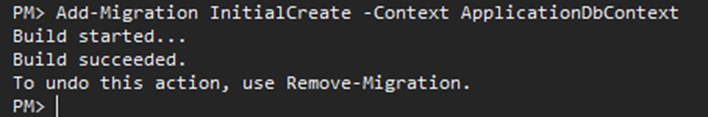

# Setup

1. Clone the project

git clone https://github.com/letsgorm/KartverketProject.git

3. Create the container. Do not forget to set the MYSQL_ROOT_PASSWORD!

docker run --name mariadbcontainer -e MYSQL_ROOT_PASSWORD=changeme -p 3307:3306 -d docker.io/library/mariadb:11.8

4. In Visual Studio -> Tools -> Command Line -> Developer Command Prompt, please type:

docker network create appnet || true

docker network connect appnet mariadbcontainer

5. Run the project's docker compose

You should now have mariadbcontainer and kartverketproject running in docker.

Remember to set the docker-compose toggle to KartverketProject and run the project so that you can see the website.

# Connecting to database

6. Create a new .env file inside the docker-compose project.
   

7. Write "DB_PASSWORD=changeme" and fill out changeme with the MYSQL_ROOT_PASSWORD that was set in step 3.

8. Change Pwd in appsettings.json so that it matches your .env file password set in step 7.
   

9. Update the database with "Update-Database" in Nuget Package Manager Console.

You should now be connected to the database.

# Migration (optional)

10. Delete the migrations folder

11. Add the migration with "Add-Migration -Context ApplicationDbContext" in Nuget Package Manager Console.

