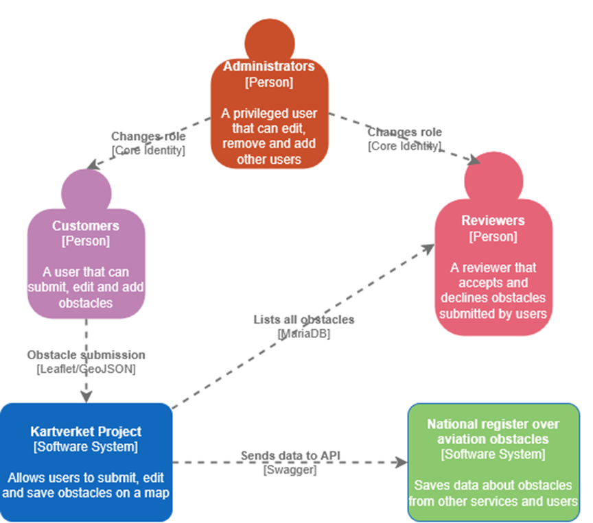
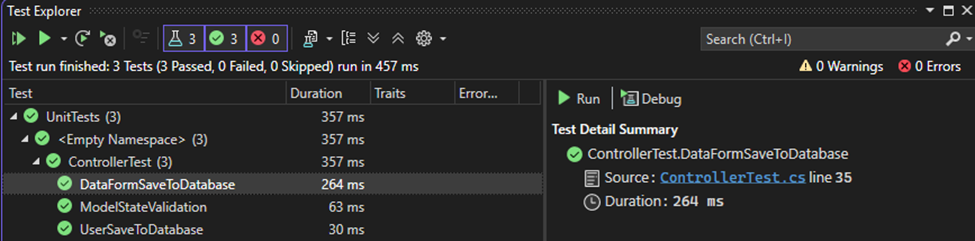

# Kartverket Project

Seamlessly register and view obstacles on the map even offline.

## Table of Contents

### Setting Up
1. [Getting Started](#getting-started)
2. [Offline Map](#offline-map)
3. [Seeded Data](#seeded-data)

### Errors
4. [Resetting Migrations](#resetting-migrations)
5. [An error occurred using the connection to the database](#an-error-occurred-using-the-connection-to-the-database)

### Architecture
6. [Model View Controller](#model-view-controller)
7. [Docker](#docker)
8. [Frontend](#frontend)
9. [Backend](#backend)
10. [System Context Diagram](#system-context-diagram)
11. [Container Diagram](#container-diagram)

### Testing
12. [Unit Test](#unit-test)
13. [System Test](#system-test)
14. [Security Test](#security-test)
15. [Usability Test](#usability-test)

### Credits
16. [Credits](#credits-1)

## Getting Started

1. Open cmd, and clone the project

2. Open the solution in Visual Studio

3. Right click the docker-compose text, and hover over Add, then click New Item.

4. Name the file .env

5. In .env, type DBPASSWORD= and then any random password. Make sure the appsettings.json also contains the password in Pwd=, otherwise it will not work.

6. Select docker-compose as the main project.

7. Run the docker-compose project.

8. Observe that all three containers have started.

## Offline Map

To be able to see the map, download the 1.17 GB ZIP below.

http://github.com/letsgorm/KartverketProject/releases/latest/download/norway.zip

Unzip the folder and place the norway.mbtiles file in KartverketProject/KartverketProject/wwwroot/

## Seeded Data

username:password

1. johnd:admin (NLA, admin)
  
2. janed:admin (NLA, reviewer)
   
3. bobs:admin (NLA, user)

4. janiced:admin (Luftsforsvaret, reviewer)

## Resetting Migrations

1. Delete migrations folder

2. Switch to KartverketProject 

3. In Visual Studio:

Tools -> NuGet Package Manager -> Package Manager Console

4. Type the following commands

Add-Migration NewMigration

Update-Database

## An error occurred using the connection to the database 

1. Open cmd, list with «docker volume ls» and then do «docker volume rm {VOLUMENAME HERE}». If it says volume is in use, go to docker desktop and delete the container.

2. Run the project as docker-compose to set up the volume again.

## System Architecture

### Model View Controller

MVC makes it easier to code, debug and test something that only has one job.

The model represents the business logic or operations. This can be in forms of error messages or storing data transfer objects. 

The view is responsible for presenting content through the user interface. This includes layouts and pages.

The controller handles user interaction and controls how the app responds to a given request. 

The user wants to register a user. The POST request hits the controller, where the controller then recieves the model. If the model validation fails, the model state saves the error. The controller then checks if the model state is valid and returns the view.

### Docker

Docker is a platform which packs the application and its dependencies into a container.

The dockerfile has the instructions to create a Docker image. 

The image is then used to build the app.

docker-compose.yml is a configuration file that sets up the containers where it gets its password from the set .env file.

The app then mounts the volumes from the host to the container.

### Frontend

Serving the static files delivers the wwwroot components to the user's browser.

https://github.com/letsgorm/KartverketProject/blob/c7bc85a6db046f4227ac6778df9241b47b521a0c/KartverketProject/Program.cs#L102

CSS is used to style the web page. The project uses Tailwind CSS to simplify this process.

JS is used to enable interactivity. The project uses Leaflet in order to create the map.

lib stores bootstrap to show premade elements while jquery allows DOM manipulation.

### Backend

ApplicationDbContext uses dependency injection in order to get services such as ASP.NET Core Identity to login and register users.

The roles admin, reviewer and admin are created. The user is created with a hashed password, as storing plaintext passwords is a security risk.

The <IdentityUser> is customized with <User> in order to add additional attributes such as Department and Active as required by the stakeholders.

Once the models have been defined, the process of migrating and updating the database creates these tables through object relational mapping. 

The project uses Entity Framework, which supports LINQ queries that perform Create, Read, Update and Delete operations on the database.

The controller is then responsible for returning views, model binding, model validation, and model errors.

### System Context Diagram

Based on the C4 model: https://c4model.com/diagrams/system-context

### Container Diagram

Based on the C4 model: https://c4model.com/diagrams/container

## Unit Test

### Model State Validation
Check if model state is valid
https://github.com/letsgorm/KartverketProject/blob/9073420b0a123a217a8d737adba32ce542875756/KartverketTest/Test1.cs#L17-L34

### Obstacle Submission
Check if obstacle is saved
https://github.com/letsgorm/KartverketProject/blob/9073420b0a123a217a8d737adba32ce542875756/KartverketTest/Test1.cs#L40-L75

### Login Redirection
Check if user is redirected when logged in
https://github.com/letsgorm/KartverketProject/blob/9073420b0a123a217a8d737adba32ce542875756/KartverketTest/Test1.cs#L81-L122

### Results
 

## System Test

### Range

During system testing, editing the report height with a large value caused this issue:

"Value was either too large or too small for an Int32."

The range was correctly set from [Range(0, 200)] to [Range(0.0, 200.0)]

### Empty Form

User submits empty data in the form.

Draft can now be edited with the empty data.

### Offline Map

Map is rendered online (no throttling) with green HTTP status (200)

Map is rendered offline with no HTTP status.

## Security Test

### ZAP

ZAP revealed Content Security Policy as a high risk.
The use of Tailwind CDN, HTTP and unset Content-Type is a security risk.
During production, the data would be stored locally instead.
In addition, HTTP would be migrated to HTTPS in order to avoid plaintext passwords being visible over the network.

[View ZAP report](security/zapscan.html)

Download the ZAP report above to see the security issues.

### Confidentiality

Reviewers are restricted based on these criterias:

1. If they own the report
2. Whether the report is shared with them
3. If they belong to the same department

https://github.com/letsgorm/KartverketProject/blob/9073420b0a123a217a8d737adba32ce542875756/KartverketProject/Controllers/AccountController.cs#L398-L401

If a report is shared with them, they cannot share it further.

https://github.com/letsgorm/KartverketProject/blob/9073420b0a123a217a8d737adba32ce542875756/KartverketProject/Controllers/AccountController.cs#L470-L472

This follows confidentiality as reviewers cannot share the report to standard users.
In addition, the need-to-know principle requires that only users who require the information shall have access to it.

### OWASP: Security Misconfiguration

#### Stack Trace

Stack trace can reveal errors which can be used for error-based SQL or XSS.

By using an exception handler, it redirects the user to an error page rather than showing the stack trace.
During development, developers need the stack trace to locate issues.

### OWASP: Identification and Authentication Failures 

#### Brute Force

In insecure web pages, attackers can find out the username due to

1. The username showing "Username/email already taken" which can allow attackers to find out the login detail.
2. The password showing "Incorrect password" which can allow the attacker to find the correct password.

This results in a "Invalid login attempt" that allows only 5 attempts;
which then locks the account for 15 minutes until the attacker can log in again.

This renders brute force essentially useless.

### OWASP: Injection

#### XSS

XSS can inject JavaScript on other users pages.
Say the attacker uses {}; alert(0); // in BurpSuite.
Then encodes the payload in URL encoding for further requests:

They can then show the alert on the page.

With parsing and serialization, the attacker can no longer do XSS.

### OWASP: Broken Access Control

#### IDOR

Authenticated users can see their own reports.
But users could potentially change the ID in the header to alter other users reports.
The code below stops a user from retrieving a report that is not theirs from the ID.

https://github.com/letsgorm/KartverketProject/blob/9073420b0a123a217a8d737adba32ce542875756/KartverketProject/Controllers/AccountController.cs#L184-L188

They get redirected to "Access Denied"

This way, users cannot change the URL in order to alter reports.

#### CSRF

CSRF tricks an authenticated user into performing an unintended action.
The attacker crafts an URL with the form that the user clicks.
This can be devastating if the user is an admin.

https://github.com/letsgorm/KartverketProject/blob/fb0fb4271ddc0f080dec6b35b7023c38041efda0/KartverketProject/Views/Obstacle/DataForm.cshtml#L57-L58

Anti forgery token is placed on the form

https://github.com/letsgorm/KartverketProject/blob/fb0fb4271ddc0f080dec6b35b7023c38041efda0/KartverketProject/Controllers/ObstacleController.cs#L34-L35

The controller then validates each request.

https://github.com/letsgorm/KartverketProject/blob/fb0fb4271ddc0f080dec6b35b7023c38041efda0/KartverketProject/Program.cs#L81

The malicious site will not have a matching CSRF token, which stops the attacker.

### Content Security Policy

https://github.com/letsgorm/KartverketProject/blob/fb0fb4271ddc0f080dec6b35b7023c38041efda0/KartverketProject/Program.cs#L81-L84

X-Frame-Options is set to DENY in order to prevent <iframe> being displayed in another origin.

X-Content-Type-Options stops attackers from executing malicious code like XSS if the browser sniffs the incorrect Content-Type.

Referrer-Policy stops URL information such as paths being included in another origin which is used for CSRF.

## Usability Test

The usability of the app was tested with a close family member.

https://youtu.be/Tqa0U8SsCfY

The video above shows that the user struggles to know how to:

1. Interact with the map.
2. Draw a marker.
3. See the form.

The form was placed to the right, as well as on the overview page.
In addition, draw mode was added in order to enable or disable drawing.

## Credits

A special thank you to DAkintola94 for assisting us and allowing us to reuse his code for Core Identity.

You can find his project here:

https://github.com/DAkintola94/MatFrem/tree/main

The security report was 

Generative AI was used to generate Tailwind CSS pages and to enhance existing code.

